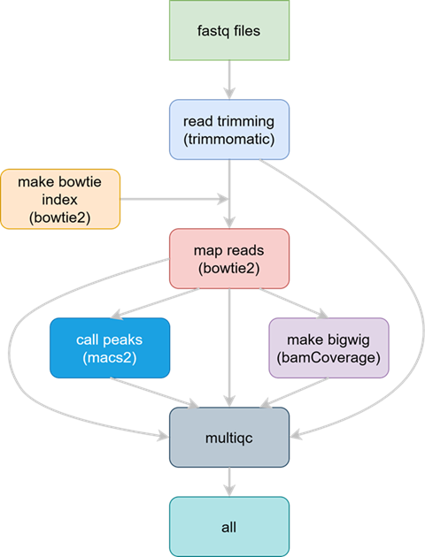

# How to run the ATAC-Seq pipeline 



**Figure 1:** Schematic representation of the Snakemake ATAC-Seq pipeline

## A. Setup the pipeline for the first time:

Note: This should be done only once.

### 1- Start an interactive session in Biowulf and go to your working directory (WD). 

### 2- Download the ATAC-Seq pipeline by running the  following command in your WD:

```bash
git clone https://github.com/TriLab-bioinf/TriLabs_pipelines.git && cd TriLabs_pipelines/ATAC-Seq
```

### 3- Download the biowulf snakemake profile from GitHub to ATAC-Seq/config directory

```bash
git clone https://github.com/NIH-HPC/snakemake_profile.git ./config/snakemake_profile
```

### Now you should be ready to run the ATAC-Seq pipeline 

## B. Running the ATAC-Seq pipeline in Biowulf

### 1- Within the config directory do the following:

- Edit the [config.yaml](config/config.yaml) file with required information
- Edit [samplesheet.csv](config/samplesheet.csv) with sample data information

### 2- Load Snakemake module

```bash
module load snakemake/7.32.4
```

### 3- OPTIONAL: Activate conda environment (if running snakemake using 4.a or 4.b below)

```bash
source ~/bin/myconda
```

### 4.a- To run the Snakemake pipeline to process sequencing data locally (dry-run)

```bash
snakemake --profile ./config/snakemake_profile --snakefile ./workflow/ATAC-Seq_pipeline.smk -p -n
```

### 4.b- To run the Snakemake pipeline to process sequencing data locally

```bash
snakemake --profile ./config/snakemake_profile --snakefile ./workflow/ATAC-Seq_pipeline.smk -p
```

### 4.c- To run the Snakemake pipeline to process sequencing data in a cluster machine (best option)

```bash
sbatch run_snakemake.sh ./workflow/ATAC-Seq_pipeline.smk
```

### 5- Extract shell commands in execution order using Python script

For a more structured output with commands organized in their execution order, you can use the `parse_snakemake_commands.py` Python script. This script parses the snakemake dry-run output and extracts shell commands along with their associated rule names and job numbers, maintaining the proper execution sequence.

#### Usage:

First, generate the snakemake dry-run output:

```bash
snakemake --snakefile ./workflow/ChIP-Seq_pipeline.smk -p -n --forceall > snakemake_output.txt
```

Then, parse the output to extract commands in execution order:

```bash
python ./scripts/parse_snakemake_commands.py -i snakemake_output.txt -o snakemake_commands_ordered.txt
```

#### Options:

- `-i/--input`: Input file containing snakemake dry-run output (required)
- `-o/--output`: Output file path (default: snakemake_commands.txt)

The output file will contain each shell command with its corresponding job number and rule name, making it easier to understand the pipeline execution flow and debug specific steps. Commands are formatted with normalized spacing and clear separators between different jobs.