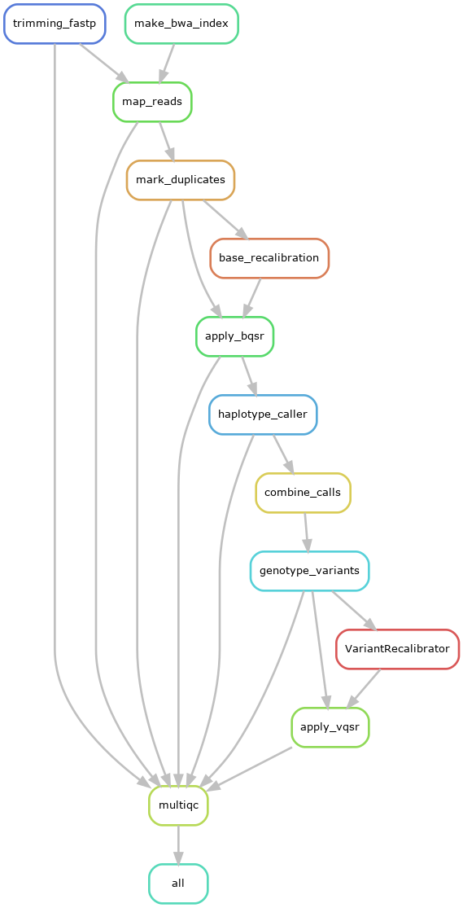

# How to run the GATK pipeline 



**Figure 1:** Schematic representation of the Snakemake GATK pipeline

## A. Setup the pipeline for the first time:

Note: This should be done only once.

### 1- Start an interactive session in Biowulf and go to your working directory (WD). 

### 2- Download the GATK pipeline by running the  following command in your WD:
```
git clone --no-checkout https://github.com/TriLab-bioinf/TriLabs_pipelines.git \
  && cd TriLabs_pipelines \
  && git sparse-checkout init --cone \
  && git sparse-checkout set GATK \
  && git checkout main
  && cd GATK
```

### 3- Copy Biowulf Snakemake profile in GATK_pipeline/config directory
```
# Download the biowulf snakemake profile from GitHub
git clone https://github.com/NIH-HPC/snakemake_profile.git ./config/snakemake_profile
```

### Now you should be ready to run the GATK pipeline 

## B. Running the GATK pipeline in Biowulf

### 1- Within the config directory do the following:

- Edit the [config.yaml](config/config.yaml) file with required information
- Edit [samplesheet.csv](config/samplesheet.csv) with sample data information

### 2- Load Snakemake module
```
module load snakemake/7.32.4
```

### 3- OPTIONAL: Activate conda environment (if running snakemake using 4.a or 4.b below)
```
source ~/bin/myconda
```

### 4.a- To run the Snakemake pipeline to process sequencing data locally (dry-run)
```
snakemake --profile ./config/snakemake_profile --snakefile ./workflow/GATK_pipeline.smk -p -n
```

### 4.b- To run the Snakemake pipeline to process sequencing data locally
```
snakemake --profile ./config/snakemake_profile --snakefile ./workflow/GATK_pipeline.smk -p
```

### 4.c- To run the Snakemake pipeline to process sequencing data in a cluster machine (best option)
```
sbatch run_snakemake.sh ./workflow/GATK_pipeline.smk
```

### 5- To fetch the shell commands ran by the snakemake pipeline use the following command
```
bash print_snakemake_shell_commands.sh -c module,trimmomatic,bwa,samtools,picard,GATK,multiqc -p workflow/GATK_pipeline.smk
```
The command above will create the file [snakemake_shell_commands.txt](workflow/snakemake_shell_commands.txt) within the `workflow` directory with an unsorted print out of all shell commands executed by the snakemake pipeline. 

 
