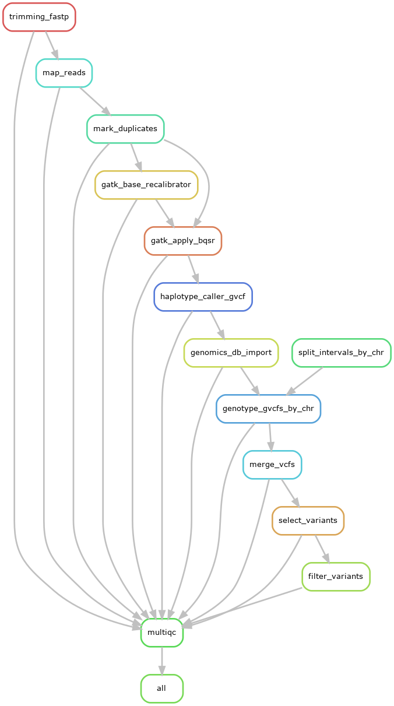

# How to run the GATK pipeline 



**Figure 1:** Schematic representation of the Snakemake GATK pipeline

## Running the GATK pipeline in Biowulf

### 1- Within the config directory do the following:

- Edit the [config.yaml](config/config.yaml) file with required information
- Edit [samplesheet.csv](config/samplesheet.csv) with sample data information

### 2- Whole Exome Sequencing (WES) data

If you are working with Whole Exome Sequencing (WES) data, you will need to provide the following two files:

- _chr_intervals.bed_: a bed file with the start and end coordinates of each chromosome or contig in the reference fasta file used for mapping. 
- _merged.exons.bed_: a bed file with the coordinates of all exons used for generating the WES data. If this information is unknown, you can generate this file from the annotation file in gtf/gff format.

There are two bash scripts that can be used to generate the two bed files above. To create _chr_intervals.bed_ you can run the following commands from the terminal:

```bash
# Using the fasta file for your reference genome run
# the following from the pipeline's working directory:

FASTA_GENOME=/path/to/fasta/file

./scripts/fasta_to_genome_interval.sh ${FASTA_GENOME} > ./data/intervals/chr_intervals.bed
```

_Note_: The script _fasta_to_genome_interval.sh_ makes use of the _samtools_ tool via the `load module` command, so make sure _samtools_ can be found via your environmental variable $PATH.

To generate the _merged.exons.bed_ file run the following commands in a terminal:

```bash
# Using the gtf/gff annotation file for your reference genome run
# the following from the pipeline's working directory:
GTF_FILE=/path/to/gtf_gff/file
FASTA_GENOME=/path/to/fasta/file

./scripts/gtf_to_exon_intervals.sh ${GTF_FILE} ${FASTA_GENOME} > ./data/intervals/merged.exons.bed
```

_Note_: The script _gtf_to_exon_intervals.sh_ makes use of the _bedtools_ tool via the `load module` command, so make sure _bedtools_ can be found via your environmental variable $PATH.

### 3- To run the Snakemake pipeline to process sequencing data in a cluster machine (best option)

First run a `dry run` to make sure that everything is configured correctly by adding the `-n` parameter to the `run_snakemake.sh` command:

```bash
./run_snakemake.sh -n
```

If everything looks OK, you can run the pipeline in the Biowulf cluster like so:

```bash
sbatch ./run_snakemake.sh
```

### 4- OPTIONAL: Activate conda environment and load the snakemake module in biowulf (if running snakemake using 5.a or 5.b below)

```bash
source ~/bin/myconda
module load snakemake/7.32.4
```

### 5.a- To run the Snakemake pipeline to process sequencing data locally (dry-run)

```bash
snakemake --profile ../snakemake_profile --snakefile ./workflow/GATK_pipeline.smk -p -n
```

### 5.b- To run the Snakemake pipeline to process sequencing data locally

```bash
snakemake --profile ../snakemake_profile --snakefile ./workflow/GATK_pipeline.smk -p
```

### 6- Extract shell commands in execution order using Python script

For a more structured output with commands organized in their execution order, you can use the `parse_snakemake_commands.py` Python script. This script parses the snakemake dry-run output and extracts shell commands along with their associated rule names and job numbers, maintaining the proper execution sequence.

#### Usage:

First, generate the snakemake dry-run output:

```bash
./run_snakemake.sh -n --forceall > snakemake_output.txt
```

Then, parse the output to extract commands in execution order:

```bash
python ./scripts/parse_snakemake_commands.py -i snakemake_output.txt -o snakemake_commands_ordered.txt
```

#### Options:

- `-i/--input`: Input file containing snakemake dry-run output (required)
- `-o/--output`: Output file path (default: snakemake_commands.txt)

The output file will contain each shell command with its corresponding job number and rule name, making it easier to understand the pipeline execution flow and debug specific steps. Commands are formatted with normalized spacing and clear separators between different jobs.
